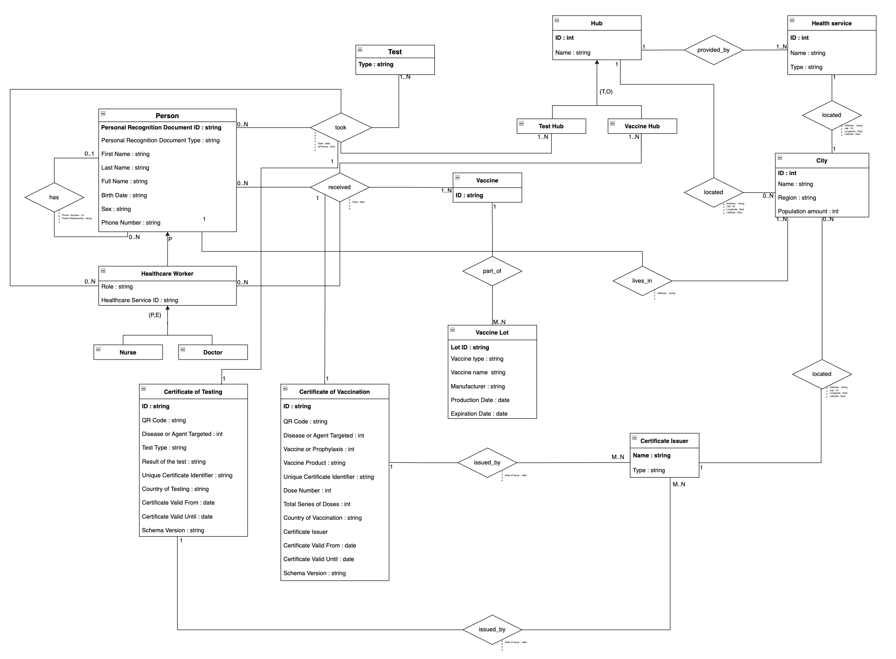
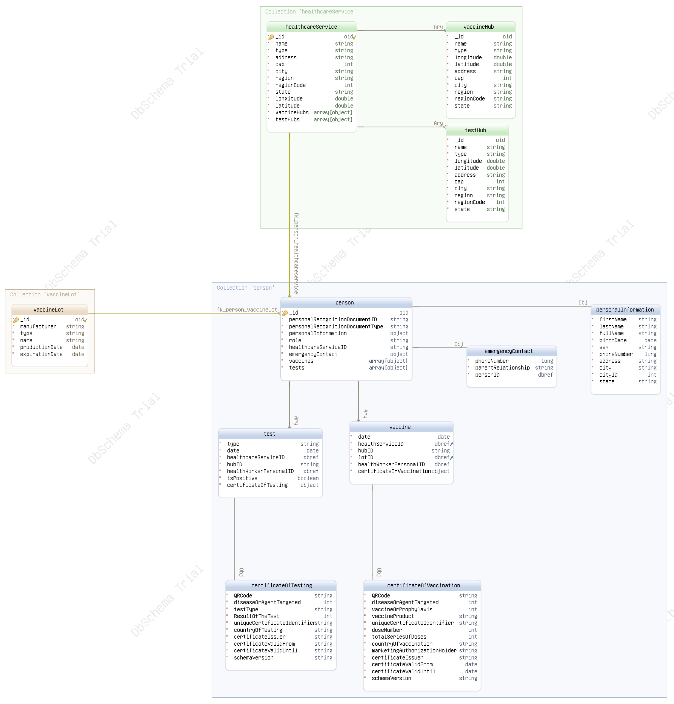

<p align="center">
  <i><font size="3">
  	Systems and Methods for Big and Unstructured Data - Delivery #2 - AA 2021/2022 - Prof. Marco Brambilla
  </i>
</p>
<h1 align="center">
	<strong>
	📄 Covid certificates-oriented MongoDB Database
	</strong>
	<br>
</h1>
<p align="center">
<font size="3">
		<a href="https://www.mongodb.com">MongoDB</a>		 
		•		
		<a href="report.pdf">Report</a>   
	</font>
</p>

This project's purpose is to keep track of **COVID-19 pandemic** data about people, authorized bodies, 
vaccines, tests and, most of all, Covid certificates of vaccination or testing by designing and implementing a document-based 
**MongoDB** database. The primary objective is to support a fast tool that checks the validity of the certificate. 
The data stored allows to extract actionable insights concerning various statistical purposes, involving information such as health services, 
vaccination & testing hubs and vaccine lots, even though the database is not optimized for these tasks, since the already mentioned main goal 
regards certificates validity check.


# Contents

- ⚙  [System requirements️](#system-requirements)
- 🚀 [Setup instructions](#-setup-instructions)
- 📜 [Report](report.pdf)
- 👨‍💻 [Usage](#-usage)
	- [Load DB Dump](#load-db-dump) 
	- [Load from CSV](#load-from-csv)
- 🗄️ [Database dump](https://1drv.ms/u/s!Ahq9yFCnfdZEjuoh3BmchG2HiwhAIg?e=zPUwxa)
- 📊 [Diagrams](#-diagrams)
- 📷 [About mimed certificates](#-screenshots)  
	- [Certificate of vaccination](#certificate-of-vaccination)
	- [Certificate of testing](#certifcate-of-testing)
- 📝 [License](#-license)

# System requirements

## Required software

- [Python](https://www.python.org/) 3.8 or higher (only if you want to perform manual load from CSVs)
- [MongoDB](https://www.mongodb.com) database
- Python modules in [requirements.txt](requirements.txt) (only if you want to perform manual load from CSVs)


# 🚀 Setup instructions

## Clone the repo

    git clone https://github.com/pablogiaccaglia/mongodb-covid-certificates
    cd mongodb-covid-certificates/

## Install required packages

From the project's directory run the following commands:

    pip install -r requirements.txt
    
# 👨‍💻 Usage

## Load DB Dump

Download the [database dump](https://1drv.ms/u/s!Ahq9yFCnfdZEjuoh3BmchG2HiwhAIg?e=zPUwxa) and navigate to the folder where it is located, then from the command line run something like this:

```
mongorestore -h host.com:port -d covid_certificates -u username -p password downloads/dumps/
```

Assuming that you want to put the contents of the database into a new database called covid_certificates. 


## Load from CSV

To populate the database from the provided CSVs and Python scripts (from which further customizations of the generated data can be performed), the first step to accomplish is to establish a connection to a MongoDB Server. 
The provided code relies on a **MongoDB Atlas** based connection, but it can easly customized to connect to a MongoDB Server on your local machine, as shown <a href="https://docs.mongodb.com/drivers/pymongo/#connect-to-a-mongodb-server-on-your-local-machine">here</a>.

As you can see in the <a href="scripts/main.py#L289">main</a>  method of the <a href="scripts/main.py">main.py</a> file, a <code>MongoDB</code> object is created in the following way:

```python
    uri = "MONGODB_URI"
    mongoDB = MongoDB(connectionURI = uri)
```

the data passed to the class' constructor is used in the init method to establish a connection through a driver:

```python
   class MongoDB(MongoClient):

    def __init__(self, connectionURI) -> None:
        super(MongoDB, self).__init__(connectionURI, connect = False)
```

After this step all you need to do is execute the main method and wait the routine to complete. 

The Python code manipulates several CSV files which can be found in different versions inside the <a href="datasets">datasets</a> folders.
Detailed information of the manipulation process which lead to the final state of the database can be found in the <a href="report.pdf">Report</a>.

# 📊 Diagrams

<h2><p align="center"><b>ER Diagram</b></></h2>

 <p align= "center">
 <kbd> 
 
 </kbd>
 </>
	 
---
	 
<h2><p align="center"><b>Document Diagram</b></></h2>

 <p align= "center">
 <kbd> 
 
 </kbd>
 </>
	 
---

# 📇 About mimed certificates

## Certificate of vaccination

This document contains information which reflects a real green certificate. In fact its fields (excepting the **QRCode** field) are compliant to the official 

<a href="https://ec.europa.eu/health/sites/default/files/ehealth/docs/covid-certificate_json_specification_en.pdf">**European eHealth network COVID certificate JSON Schema Specification**</a>, even though not all the specified fields are here included. In particular these fields are :

- <code>**QRCode**</code>: This string value represent the encoded JSON '**certificateOfVaccination**' document, excluding this field. The process for producing this remotely mimics what the <a href="https://ec.europa.eu/health/sites/default/files/ehealth/docs/vaccination-proof_interoperability-guidelines_en.pdf">European eHealth Trust Framework for Certificates</a> expects. The process we applied is the following:
        
	- JSON Dump of the Python dictionary representing the certificate.
	- UTF-8 encoding of the JSON string.
	- Base 45 encoding of the bytes generated by the previous encoding.
	- Compression with zlib of the previously generated bytes.
	- QR Code Image generation with qrcode Python library.
	- Base 64 encoding of image bytes.
	- Bytes conversion to string.
        
    Through appropriate functions the process can be performed backwards to obtain both the QR Code and the original JSON string.
        
- <code>**diseaseOrAgentTargeted**</code>: This value set has a single entry **840539006** , which is the code for COVID19 from SNOMED CT.

- <code>**vaccineOrProphylaxis**</code>: **SNOMED CT** code indicating the vaccine or prophylaxis used. The mapping is the following: 
	- **SARS-CoV2 antigen vaccine**: <code>1119305005</code> 
	- **SARS-CoV2 mRNA vaccine**: <code>1119349007</code>
        
- <code>**vaccineProduct**</code>: Code complying the Union Register of medicinal products code system representing Medicinal product used for the specific dose of vaccination, The mapping is the following:
	- **Pfizer Vaccine**: <code>EU/1/20/1528</code>
	- **Moderna Vaccine**: <code>EU/1/20/1507</code>
	- **AstraZeneca Vaccine**: <code>EU/1/21/1529</code>
	- **Janssen Vaccine**: <code>EU/1/20/1525 </code>
        
- <code>**uniqueCertificateIdentifier**</code>: Unique certificate identifier (**UVCI**), whose structure mimics the one specified in this document only in terms of sequence of digits and characters.
        
- <code>**doseNumber**</code>:Sequence number (positive integer) of the dose given during a vaccination event. 1 for the first dose, 2 for the second dose etc.
        
- <code>**totalSeriesOfDoses**</code>: Total number of doses (positive integer) in a complete vaccination series according to the used vaccination protocol. In the database this value is set to 1 for "Janssen" vaccine certificate, 2 in all the other cases.
        
- <code>**countryOfVaccination**</code>: Country expressed as a 2-letter ISO3166 code. In the current database this value is 'IT', since the data regards Italy.
        
- <code>**marketingAuthorizationHolder**</code>: Marketing authorisation holder code from **EMA SPOR Organisations Management System**. The mapping is the following:
	- **AstraZeneca AB**: <code>ORG-100001699</code>
	- **Biontech Manufacturing GmbH**: <code>ORG-100030215</code>
	- **Janssen-Cilag International**: <code>ORG-100001417</code>
	- **Moderna Biotech Spain**: <code>ORG-100031184  </code>
        
- <code>**certificateIssuer**</code>: Name of the organisation that issued the certificate. In the current database this value is always **Italian Ministry of Health** since the data regards Italy.
        
- <code>**certificateValidFrom**</code>: The first date on which the certificate is considered to be valid, provided in the format <code>YYYY-mm-ddTHH:MM:ss</code>. Following what specified here, in the current database this date if after 15 days from the first dose and after 3 days in case of "Janssen" Vaccine.
        
- <code>**certificateValidUnti**</code>: The last date on which the certificate is considered to be valid, assigned by the certificate issuer, provided in the format <code>YYYY-mm-ddTHH:MM:ss</code>. Following what specified here, in the current database this date is after 28 days from the vaccination in case of first dose, 270 days in case of second dose or single dose.
        
- <code>**schemaVersion**</code>: Value matching the identifier of the schema version used for producing the EUDCC. In the current database this value is set to <code>1.0.0</code>.

## Certificate of testing

This document contains information which reflects a real green certificate. In fact its fields (excepting the **QRCode** field) are compliant to the official <a href="https://ec.europa.eu/health/sites/default/files/ehealth/docs/covid-certificate_json_specification_en.pdf">European eHealth network COVID certificate JSON Schema Specification</a>, even though not all the specified fields are here included. 
In particular these fields are :

- <code>**QRCode**</code>: This string value represent the encoded JSON 'certificateOfVaccination' document, excluding this field. The process for producing this remotely mimics what the European eHealth Trust Framework for Certificates expects. The process we applied is the following:
        
	- JSON Dump of the Python dictionary representing the certificate.
	- UTF-8 encoding of the JSON string.
	- Base 45 encoding of the bytes generated by the previous encoding.
	- Compression with zlib of the previously generated bytes.
	- QR Code Image generation with qrcode Python library.
	- Base 64 encoding of image bytes.
	- Bytes conversion to string.
        
- <code>**diseaseOrAgentTargeted**</code>: This value set has a single entry <code>840539006</code> , which is the code for COVID19 from **SNOMED CT**.
        
- <code>**testType**</code>:  The type of the test used's LOINC code, based on the material targeted by the test. According to this report, the mapping is the following :
	- **Molecular**: 94309-2
	- **Antigen**: 94558-4
	- **Antibody**: 94762-2
        
- <code>**resultOfTheTest**</code>: coded value based on **SNOMED CT**. The mapping is the following:
	- **Detected**: 260373001
	- **Not Detected**: 260415000
        
- <code>**uniqueCertificateIdentifier**</code>: Unique certificate identifier (**UVCI**), whose structure mimics the one specified in this document only in terms of sequence of digits and characters.
        
- <code>**countryOfTesting**</code>: Country expressed as a 2-letter **ISO3166** code. In the current database this value is **IT**, since the data regards Italy.
        
- <code>**certificateIssuer**</code>: Name of the organisation that issued the certificate. In the current database this value is always *Italian Ministry of Health* since the data regards Italy.
        
- <code>**certificateValidFrom**</code>: The first date on which the certificate is considered to be valid, provided in the format <code>YYYY-mm-ddTHH:MM:ss</code>. Following what specified here, in the current database this date is after 3 days for the Antibody test, 2 days the Molecular test and 0 days for the Antigen test, which are the result wait days.
        
- <code>**certificateValidUnti**</code>: The last date on which the certificate is considered to be valid, assigned by the certificate issuer, provided in the format <code>YYYY-mm-ddTHH:MM:ss</code>. Following what specified here, in the current database this date is after 3 days from the result date for the Molecular test and the Antibody test, 2 days for the Antigen test.
        
- <code>**schemaVersion**</code>: Value matching the identifier of the schema version used for producing the **EUDCC**. In the current database this value is set to <code>1.0.0</code>.


# 📝 License

This file is part of "Covid certificates-oriented MongoDB Database".

"Covid certificates-oriented MongoDB Database" is free software: you can redistribute it and/or modify
it under the terms of the GNU General Public License as published by
the Free Software Foundation, either version 3 of the License, or
(at your option) any later version.

"Covid certificates-oriented MongoDB Database" is distributed in the hope that it will be useful,
but WITHOUT ANY WARRANTY; without even the implied warranty of
MERCHANTABILITY or FITNESS FOR A PARTICULAR PURPOSE.  See the
GNU General Public License for more details.

You should have received a copy of the GNU General Public License along
with this program (LICENSE.txt).  If not, see <http://www.gnu.org/licenses/>
